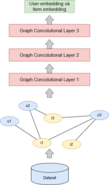
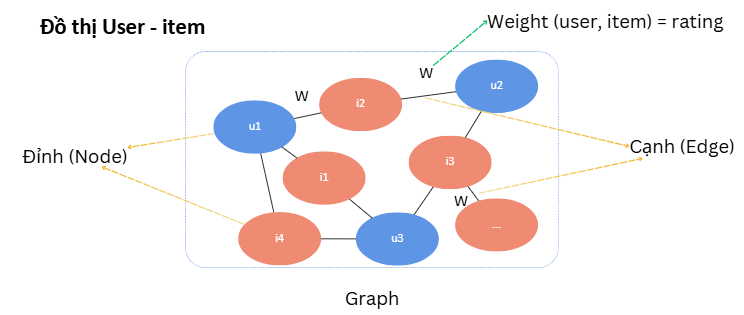

# Recommendation System Using Content-based Graph Convolutional Network (GCN)
## Thông tin về các file
- Thư mục ml-100k chứa dữ liệu từ tập MovieLens 100k
- file analizing_data.ipynb là phần phân tích dữ liệu đầu vào
- file FilmRS_GCN3.ipynb là phần xây dựng, huấn luyện, đánh giá và thực nghiệm mô hình đề xuất phim
- file gcn_model.pth là mô hình được lưu lại để đưa vào hệ thống đề xuất phim

## Đây là sơ đồ mô hình GCN 3 lớp

## Dữ liệu đầu vào
Mô hình sử dụng dữ liệu đầu vào là tập dữ liệu MovieLens 100k bao gồm 100,000 đánh giá (từ 1 đến 5 sao) của 943 người dùng trên 1,682 bộ phim. Dữ liệu được thu thập thông qua trang web MovieLens trong khoảng thời gian bảy tháng từ ngày 19 tháng 9 năm 1997 đến ngày 22 tháng 4 năm 1998.
- Dữ liệu người dùng: ID của người dùng, tuổi, giới tính, nghề nghiệp, zipcode
- Dữ liệu phim: ID phim, tên phim, ngày phát hành, thể loại, …
- Dữ liệu tương tác: thông tin về việc người dùng đã đánh giá những bộ phim nào.

Đầu ra: Tập dữ liệu MovieLens 100k cơ bản đã được làm sạch, những người dùng có ít hơn 20 đánh giá hoặc không có thông tin nhân khẩu học đầy đủ đã bị xóa khỏi tập dữ liệu này. Ngoài ra, dữ liệu còn được tiền xử lý để đảm bảo dữ liệu đồng nhất và không bị thiếu. 

Phần phân tích dữ liệu nằm trong file analizing_data.ipynb
## Xây dựng đồ thị user-item

- Đồ thị này là đầu vào của mô hình GCN
## Các lớp tích chập
- Mô hình gồm 3 lớp GCN trích xuất các đặc trưng cho user và item
## Đầu ra của mô hình
- Ma trận gồm các vector đặc trưng của người dùng và item
